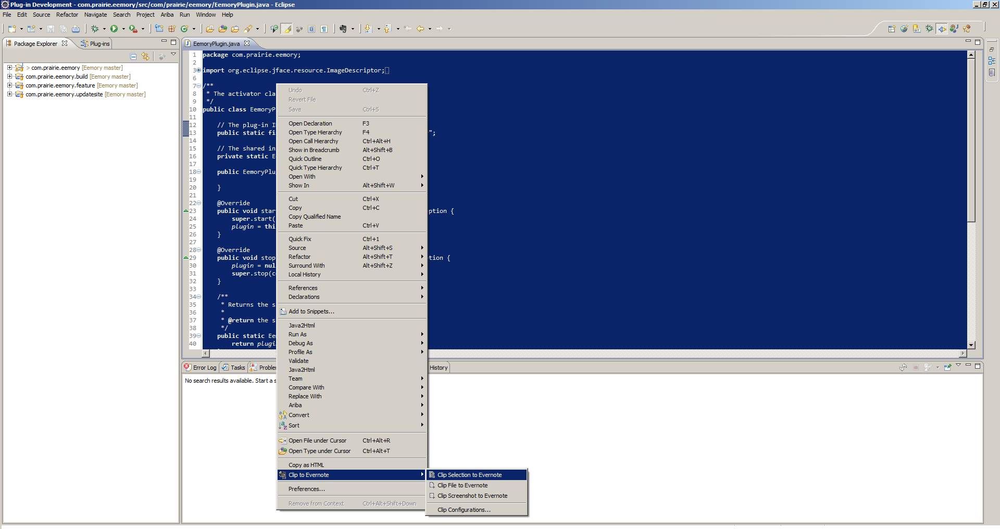

# Eemory

Eemory is an Eclipse Plug-in aimed at integrating Evernote within the Eclipse IDE.

I love Evernote, but every time I must switch between Eclipse IDE and Evernote client, copy sometihng and paste, then go back to Eclipse and continue on my work. This is heavy and boring, so Eemory was born, which bring the benefits offered by Evernote into Eclipse. No need to open Evernote client anymore to add a note, just select something and one-click to save to Evernote elegantly. And you will find you are still in Eclipse.

Visit [Eemory]() Home.  
Visit [Eemory](http://marketplace.eclipse.org/content/eemory) at Eclipse Marketplace.

## Features

+ Adding code snippet, source file, screenshot and more to a new note on Evernote.
+ Appending code snippet, source file, screenshot and more to an existing note on Evernote.
+ Adding/Appending multiple files once.
+ Notebook, Note and Tag can be specified(no need to remember their names, we have auto-suggestion).
+ Also can specify comment for each clip.
+ Syntax highlighting for any language on Evernote just like what you see in Eclipse.
+ One-click OAuth as easy to use as what an web application can do.

## Limits

+ Can not handle `>` appear in the value for the attributes of an XML(called ENML in Evernote context) document. This only happens when you clip content to an existing note on Evernote. Even though Eemory will not break your data, just an error dialog will pop up. If you don't clear about what are talking about here, don't worry, this just means Eemory accept a [SGML-compatible](http://www.w3.org/TR/REC-xml/#dt-compat) XML, which is almost most cases.

## Screenshots

## Installation

Pre-built package is ready to install. Require Eclipse Ganymede(3.4) and higher, Java 1.6 and higher.

+ Install from Eclipse Marketplace(recommended).
+ Install from update site URL: `http://dl.bintray.com/prairie/eemory-update-site`.
+ Install from [archive update site](https://github.com/prairie/Eemory/releases) locally.

New to Eclipse plug-in? Please check out this [wiki](https://github.com/prairie/Eemory/wiki).

## Contributing

Interested? Awesome! Please refer to Todo list below, once get ready for your code and feel free to submit a pull request. You have your features want to implement? Just go ahead.

We are always thrilled to receive pull requests, and do our best to process them as fast as possible.

The only principle when you working on this we need to remember is simple and intuitive.

Need more information? Please check out this [wiki](https://github.com/prairie/Eemory/wiki).

## Todo

+ Add preference page with preference configurations:
 - Customize title of clipped note. User can specify the format of clipped note title using Regex or something else.
 - Append or insert to head when updating note.
 - To one note or separate notes when clipping multiple files once.
+ Clip video support. Allow user to record a video and add to Evernote.
+ Caching user data that was sent to Evernote when the error occurred so it can be sent again after troubleshooted.
+ YXBJ support.
+ Revoke authorization from plug-in side.

## Authors

+ Jianwei Liu

## License

Eemory is released under the [MIT license](http://www.opensource.org/licenses/MIT).
